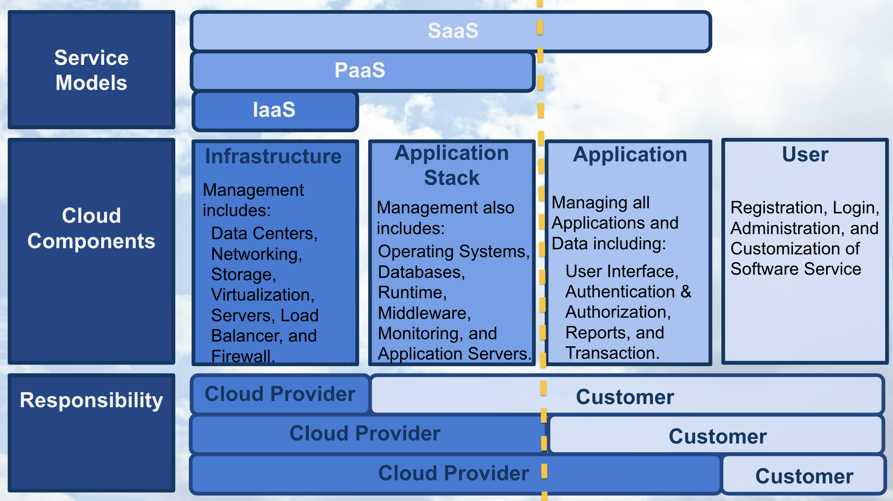

[Optional] Cloud Computing Defined
The following content is optional, it's provided to give students a greater understanding of cloud computing if they are interested in learning more.

Cloud Computing Defined by Cloud Providers and References
Cloud computing was first formally defined by the National Institute of Standards and Technology (NIST) using service models, deployment models, and essential characteristics (see 1 in References). Using this formal definition, authors Thomas Erl and Michael Kavis explained in more detail cloud computing, its service models, its deployment models, and its essential characteristics in their books (see 2 & 3 in References). Cloud providers Amazon, Google, and Microsoft also provide more modern and evolving explanations of cloud computing, its service models, its deployment models, and its essential characteristics (see 4, 5, & 6 in References). The information found in this section is based upon the materials that we have included in the References at the end of this section.

Defining Cloud Computing
Recall the Cloud Computing Example
Where we stored our vacation photos in the cloud using a cloud storage provider, like: Google Drive, Apple’s iCloud, or Microsoft’s OneDrive, instead of storing them on a flash drive.

With this example, we demonstrated that cloud computing can simply be thought of as transforming an Information Technology (IT) product into a service. With our vacation photos example, we transformed storing photos on an IT product, the flash drive; into storing them using a service, like Google Drive.

The vacation photo example illustrates how cloud storage service provides the benefits of making it easier to access and share our photos. In general, most of the factors related to choosing cloud computing services, instead of developing on-premise IT resources are associated with benefits related to time and cost.

Below we will explain in detail the formal definition of cloud computing.

NIST Cloud Computing Definition

In 2011, the National Institute of Standards and Technology (NIST) defined cloud computing using service models, deployment models, and essential characteristics.

While you have already learned that cloud computing is thought of as transforming an IT product, a flash drive, into a cloud service, Google Drive; next we take a more detailed look at cloud computing.

Service Models of Cloud Computing
Let’s begin by discussing the three service models of cloud computing.

NIST Cloud Computing - Service Models

Software as a Service
Starting with Software as a Service, SaaS, we’ll use the following graphic to depict the components that compose each of the three service models. The graphic shows whose responsibility it is to create, customize, and maintain the components. The yellow dashed line in the graphic shows with SaaS, the only customer responsibilities are those attributed to a “user” of the service and all other responsibilities are placed upon the cloud provider.

Service Models - SaaS

Software as a product is becoming more rare these days. It used to be that productivity software, like Microsoft Office, was loaded from a physical CD; now you can use applications like Google docs to write, edit, share, and store documents using cloud infrastructure.

Google docs is one example of Software as a Service. Some other examples of SaaS are email applications like gmail and hotmail, and storage applications like iCloud or OneDrive.

With SaaS, a cloud provider’s application that’s running on cloud infrastructure is provided to customers as a service. The customer’s responsibility is only to maintain their user account which typically includes: registration, login, administration, and customization of the software application they’re using as a service.

Platform as a Service
With Platform as a Service, PaaS, the yellow dashed line demonstrates that the customer gains additional responsibilities that are associated with managing all applications and data, such as including a user interface and dashboard, security, logs, and other features associated to the data and applications.

Service Models - PaaS

Some examples of Platform as a Service, are Heroku and Engine Yard. These services allow users to easily build, host, monitor, and scale their applications using their platform. For example, you might use Heroku to build and host an e-commerce website. Google’s App Engine is a similar PaaS for application development and deployment. The creator of “Angry Birds”, Rovio, used Google App Engine to create an online versions of their game.

With PaaS, the service provided to the customer is the ability to deploy customer-created or customer-acquired applications using the cloud provider’s platform. If you are interested in learning more about Rovio’s story using the Platform as a Service, Google App Engine, click on the following link.

Infrastructure as a Service
With the service model Infrastructure as a Service, IaaS, as shown with the yellow dashed line; the customer has most of the responsibility beyond those associated with running secure data centers and maintaining the hardware and software that enables IaaS.

Service Models - IaaS

Some examples of IaaS are Amazon Web Services and Rackspace, which were among the first to offer Infrastructure as a Service that allowed their customers to use virtual machines.

Essentially a virtual machine is similar to a laptop or desktop computer, except it’s offered as a cloud service; requiring the user to login to their virtual machine through an internet connection.

IaaS enables the customer to provisioning computer processing, storage, networks, and other fundamental computing resources, where the consumer can deploy and run software using the provider’s cloud infrastructure.

Although Amazon, Microsoft, and Google all offer IaaS, they also offer other services that fall within the services models Platform and Software "-as-a-service". While you’re likely using “software-as-a-service” for your email, now that you understand the service models, consider expanding your usage of cloud to platform and infrastructure “as-a-service”.

Service Models Importance
All three service models provide access to greater computing capability and resources for an affordable price.
With Google App engine you could build the next popular online game, like Angry Birds, or use Amazon’s Virtual Machine service to have access to a more powerful computer instead of upgrading your own.

QUESTION 1 OF 3
Match the Cloud Service with the correct Service Model

CLOUD SERVICE

SERVICE MODEL

Cloud Email Service, like Gmail or Yahoo! Mail

Application development and deployment, like Heroku or Google App Engine

WiX Website builder

Use of Virtual Machine Service, like Amazon's EC2, Microsoft Azure Virtual Machine, or Google's Compute Engine

Deployment Models of Cloud Computing
Let’s discuss the four deployment models that define cloud computing.

NIST Cloud Computing - Deployment Models

Different levels of security are automatically provided with each deployment model. Understanding deployment models are important in providing the appropriate level of security on the cloud services you use. The primary way to distinguish between different deployment models is by the group that’s provisioning the cloud services. With provisioning, we simply mean the group that’s providing the cloud services for their group’s use.

Public Cloud
Most cloud deployment models offered by cloud providers, like Amazon Web Service or Google Cloud Platform, are public clouds. Public clouds are provisioned for use by the general public and they are the least secure of the deployment models. Because public clouds are the least secure, most providers allow customers to enable features that provide a “virtual private cloud” to increase the security on their public clouds.

Community Cloud
Amazon Web Services’ GovCloud is an example of a community cloud. GovCloud customers are limited to US federal government employees, contractors, and agencies that have been granted access. Community clouds are more secure than public clouds because providers limiting access to community members and they isolate computing resources used by the community. A community cloud deployment model is provisioned by a specific community of customers from different organizations that have shared interests, like the US federal government in our GovCloud example. Shared interests may include a shared mission, security requirements, policies, and/or compliance considerations.

Private and Hybrid Clouds
Private cloud deployment model is provisioned for exclusive use by a single organization. Amazon Web Services offers a Virtual Private Cloud service, but this isn’t considered truly a private cloud unless customers enable additional features that isolate the hardware their cloud services are run on. A private cloud can be physically located on a company’s on-site data center or on a cloud provider’s data center. If the private cloud is provided by a cloud provider, then the private cloud services and infrastructure are always maintained on a private network with hardware and software dedicated solely to the customer’s organization. The hybrid clouds are simply composed of two or three of the different types of deployment model.

QUESTION 2 OF 3
Most cloud deployment models offered by cloud providers are typically _________ cloud by default.

Essential Characteristics of Cloud Computing
Let’s discuss the five essential characteristics that define cloud computing. These characteristics describe the necessary attributes a service must have to be considered “cloud computing”.

NIST Cloud Computing - Essential Characteristics

As we discuss these essential characteristics, keep in mind our example of uploading a file, like the vacation photos, to a cloud storage service, like Google Drive. These essential characteristics just define aspects of the path your file travels from your laptop to the cloud provider’s data center.

Cloud Computing - Uploading file to a Data Center

On-Demand Self Service
The essential characteristic on-demand self service means that a customer must be able to automatically provision computing capabilities from the cloud provider without requiring human interaction from the provider. Using our example of cloud storage, on-demand self service is characterized by the ability to log into the cloud storage service and upload, download, or delete the files you have stored within the service at any time without requiring a cloud provider employee to help with these activities.

Broad Network Access
Broad Network Access means that the computing capabilities are made available over the network accessed through standard mechanisms. Your smartphone, tablet, computer use this broad network access to allow you to work remotely, check social media, reply to an email, and generally access the internet. With our example of cloud storage, Broad Network Access is characterized by the ability to access the files you have stored with the cloud provider using any device that is connected to the internet. Noting that the cloud provider is responsible to ensure the path between the network and the data center.

Resource Pooling
Resource Pooling allows the cloud provider’s computing capabilities to be pooled to serve multiple customers with different virtual resources that are dynamically assigned and re-assigned based upon customer demand. Using our example of cloud storage, Resource Pooling enables the cloud provider to supply storage services to many customers using their data center to store all their customers’ files. Additionally, the provider’s storage service must be able to handle any customer storing one to many files.

Rapid Elasticity
Rapid Elasticity enables the cloud provider’s computing capabilities to be elastically provisioned and released to scale rapidly outward and inward proportional to customer demand. This ability to scale rapidly allows the cloud services to appear to have unlimited capabilities that can be used at any time for any quantity of demand. With our example of cloud storage, Rapid Elasticity provides the customer with the ability to store as many or as few files at any time.

Measured Service
Measured Service allows the cloud provider’s system to automatically control and optimize resource usage by leveraging the system’s metering capability. Specifically, the cloud provider’s resource usage can be monitored, controlled, and reported, which provides the necessary transparency for appropriately billing customers for cloud service usage. Using our example of cloud storage, Measured Service enables the cloud provider to charge a customer appropriately for storage space they are using to store their files.

QUESTION 3 OF 3
Check all characteristics below that are not one of the Essential Characteristics.

Summarizing Cloud Computing

NIST Cloud Computing Definition

You’ve learned what it takes to transform an IT product into a cloud service. In doing so you learned about the three service models, the four deployment models, and the five essential characteristics of cloud computing. Understanding the definition of cloud computing will help you make appropriate decisions when deploying machine learning models in your workplace.

References
Below are links and books that provide more detailed information on the topics discussed in this section above.

1. NIST formal definition of Cloud Computing is found here.

2. Erl, T., Mahmood, Z., & Puttini R. (2013). Cloud Computing: Concepts, Technology, & Architecture. Upper Saddle River, NJ: Prentice Hall.

Chapter 4: Discusses Cloud Computing Service Models, Deployment Models, and Essential Characteristics.
Chapter 5: Discusses some Cloud enabling technologies in more detail.
3. Kavis, M. (2014). Architecting the Cloud: Design Decisions for Cloud Computing Service Models. Hoboken, NJ: Wiley.

Chapter 2: Discusses Cloud Computing Service and Deployment Models.
Chapter 5: Discusses how to choose the right Service Model.
Chapter 9: Discusses security responsibilities by Service Model.
4. Amazon Web Services (AWS) discusses their definition of Cloud Computing, Cloud Solutions by Application, and Service & Deployment Models.

5. Google Cloud Platform (GCP) discusses their definition of Cloud Computing and it's benefits here.

6. Microsoft Azure (Azure) discusses their definition of Cloud Computing and it's service and deployment models here.
