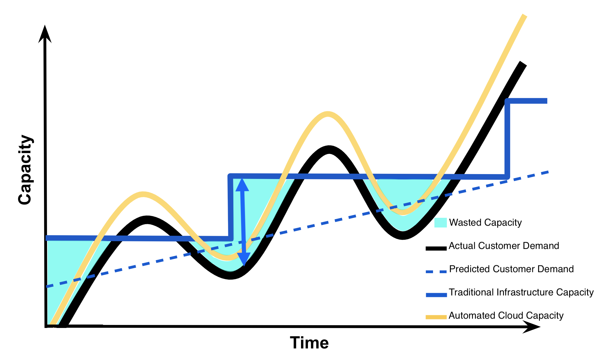
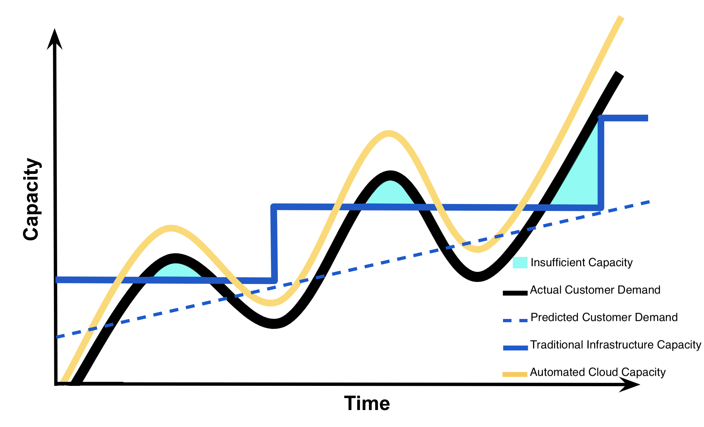
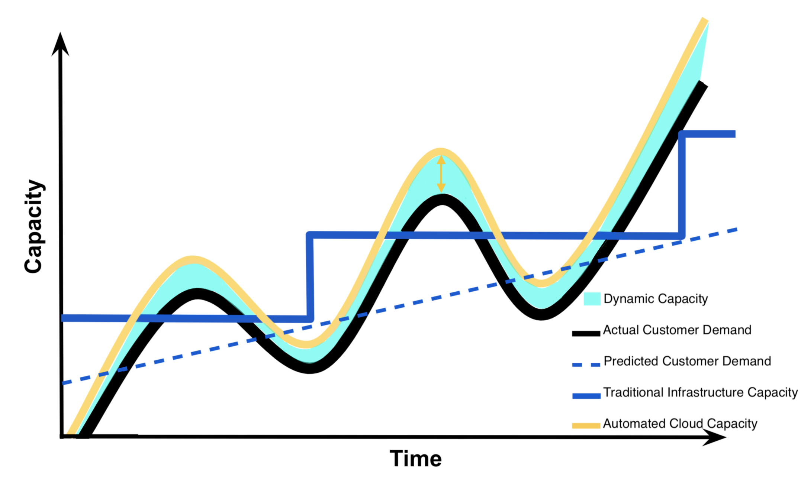

[Optional] Cloud Computing Explained

The following content is optional, it's provided to give students a greater understanding of cloud computing if they are interested in learning more.

Cloud Computing Drivers, Benefits, and Risks provided by Cloud Providers and References
The capacity utilization graphic that you will see in this section was originally presented by AWS in 2012 to help explain the benefits of cloud computing. As usage of cloud computing has become more ubiquitous in recent years, cloud providers Amazon, Google, and Microsoft have evolving benefits and improved security within their cloud services (see 3, 4, & 5 in References). Authors Thomas Erl and Michael Kavis explained in more detail the business drivers, benefits, and risks of cloud computing in their books (see 1 & 2 in References). The information found in this section is based upon the materials that we have included in the References at the end of this section.

Recall why businesses decide to use cloud computing
Remember that most of the factors related to choosing cloud computing services, instead of developing on-premise IT resources are related to time and cost. Below we have an example that explains why startups use cloud services.

Imagine it’s 2010 and you created a photo-sharing application called Instagram. Some challenges you face are you have little funding, few employees, and your application will need to scale to meet customer usage. Ideally, your application needs to scale to meet spikes in demand without having to put limits on application usage or the number of supported users. Because you’re unsure about how popular your application will be, you don’t want to spend funding to prepare for users you may not have. Instead, you want to spend those funds on advertising and extra features to attract more users.

You’ve learned cloud computing provides pay-as-you-go service (on-demand self service), that can be available to anyone with wireless or internet connection (broad network access), and can scale up and down rapidly (rapid elasticity) to meet customer demand easily. These features of cloud computing make using cloud the obvious choice to launch your photo sharing application.

While it may make sense why a startup like Instagram chose to use cloud services, it may be more perplexing why an established organization would consider incorporating cloud services into their infrastructure. Addressing these questions will provide you with information that will guide decisions you will make when deploying machine learning models within your workplace.

Capacity Utilization Graph
To understand why an established organization would consider incorporating cloud services into their infrastructure, it’s important to understand the capacity utilization over time graph below. I’m going to explain this graph in detail to illustrate the business drivers and benefits of cloud computing for both startups and established organizations.

Capacity Utilization Graph

Axes
Along the y-axis or vertical axis of this graph is capacity. Capacity can be thought of as a number of IT resources like compute capacity, storage, networking, etc. This capacity also includes the costs associated with these IT resources. For traditional non-cloud infrastructures, this would include purchase and maintenance of these resources. For cloud infrastructures, this would only include paying for use of these IT services. Along the x-axis or horizontal axis of this graph is time. Generally, lines plotted on this graph depict capacity across time.

Lines
For understanding this graph, we are going to return to our Instagram example. Imagine this graph depicts the capacity needed for Instagram’s photo-sharing application across a period of a few months. The black curvy line depicts the actual customer demand for capacity based upon the customers’ usage of the photo-sharing application. The spikes in demand may indicate increased usage by registered Instagram users. The general rise in the black curved line over time indicates an increase in the number of registered users of the Instagram application.

The dashed blue line depicts the predicted customer demand for capacity based upon the predictions Instagram would have made if they would have decided to use traditional non-cloud infrastructure. Instagram would have had to base these predictions on historical data and current trends.

The blue step-like line depicts how much capacity is provided by the traditional non-cloud infrastructure and hardware. If Instagram would have had decided to not use cloud services, this blue step-like line would have been the capacity that Instagram would have provided their customers. In this scenario where Instagram is using traditional infrastructure, they would have needed to build or purchase their own data center and computing resources to provide capacity for their customers.

The yellow curvy line depicts how much capacity Instagram would provide using cloud infrastructure to meet their customers’ demands for capacity. Notice that using cloud infrastructure will provide automated cloud capacity as a service. This automated cloud capacity enables a company the ability to meet and exceed customer demands, unlike if they had chosen to use traditional non-cloud infrastructure.

Interpretation of Graph
We explain the graph in detail to demonstrate the benefits of cloud infrastructure. With traditional infrastructure, it takes a considerable amount of time to predict demand, obtain approval for capacity increase, purchase new resources, and install these resources. The graph below depicts this lag of time with how traditional infrastructure is increased to the level of predicted future demand. The point select is the time at which they would be able to increase traditional infrastructure again.

If Instagram had decided to use traditional non-cloud infrastructure, they would have needed more capital to make the investment in traditional infrastructure and they would have needed to overestimate customer demand for capacity. This overestimation of customer capacity provides Instagram with the additional time needed to upgrade traditional infrastructure to meet an increasing customer demand.

Wasted Capacity
The cyan shaded area in this graph below depicts the amount of wasted capacity that Instagram would have had with traditional non-cloud infrastructure while they waited for customer demand to meet their capacity. Specifically, the blue arrow shows the large costs associated with Instagram attempting to answer the variability in their customer demand for capacity by overestimation of demand using traditional infrastructure.

Capacity Utilization Graph - Wasted Capacity

Insufficient Capacity
Due to the lag in time needed to upgrade traditional infrastructure, if Instagram failed to overestimate customer demand correctly they run the risk of losing their customers as represented by the cyan shaded area in this graph below. This cyan shaded area depicts the amount of insufficient capacity that Instagram would have had with traditional infrastructure, once customer demand exceeds their capacity. Specifically, the cyan shaded areas represent the costs associated with losing customers due to failure to meet customer demand when the demand exceeds capacity provided by traditional infrastructure.

Capacity Utilization Graph - Insufficient Capacity

Dynamic Capacity
Understand that with cloud infrastructure, one can set automated triggers that will increase or decrease cloud capacity once a certain level customer demand has been reached. If Instagram uses cloud infrastructure, they will be able to set automatic triggers so that their cloud capacity always exceeds their customer demand for capacity by a small margin as to avoid having insufficient capacity and losing customers. Specifically, the yellow arrow in the graph below shows this ability for cloud infrastructure to automatically meet customer demand. The cyan shaded area in this graph below depicts the amount of dynamic capacity Instagram would need to maintain using cloud infrastructure to guarantee they meet their customers’ demand as to avoid losing customers.

Capacity Utilization Graph - Dynamic Capacity

Summarizing the Capacity Utilization Graph
Now that we understand this graph, we understand why Instagram or any company would benefit from using cloud infrastructure instead of traditional non-cloud infrastructure with regards to meeting customer demand. This understanding is what drives businesses to consider using cloud computing services.

QUIZ QUESTION
Select all choices below that are included as part of Capacity (the y-axis) in the Capacity Utilization Graph.

Benefits of Cloud Computing
The capacity utilization graph above was initially used by cloud providers like Amazon to illustrate the benefits of cloud computing. Summarized below are the benefits of cloud computing which are often what drives businesses to include cloud services in their IT infrastructure [1]. These same benefits are echoed in those provided by cloud providers Amazon (benefits), Google (benefits), and Microsoft (benefits). Additionally, these benefits are tightly coupled with what drives businesses to use cloud computing. In the sections below we explain these benefits and business drivers in greater detail.

Benefits
Reduced Investments and Proportional Costs (providing cost reduction)

Increased Scalability (providing simplified capacity planning)

Increased Availability and Reliability (providing organizational agility)

Reduced Investments and Proportional Costs
Using cloud computing has the benefit of reducing investments and having costs proportional to the usage of cloud services. Recall that cloud computing provides on-demand access to pay-as-you-go cloud computing services; therefore, reducing the necessity to invest in computational resources that will not be used. Additionally, pay-as-you-go services make using cloud resources proportional to their costs. This is illustrated by how automated cloud capacity can meet actual customer demand without wasting capacity nor having insufficient capacity to meet demand.

The automated cloud capacity that always meets customer demand while minimizing wasted capacity, provides cost savings. Specifically, cloud computing provides this direct alignment between cost and performance, the minimization of wasted capacity, and the elimination of insufficient capacity which results in cost reduction. Additionally, there are also savings in removing the need to spend company resources on prediction of customer demand. This cost reduction that's associated with the benefit of reducing investments and having proportional costs is typically considered a business driver of cloud computing.

Increased Scalability
Cloud computing also provides the benefit of increased scalability. This is also demonstrated by cloud capacity meeting customer demand. Using automatic triggers and the rapid elasticity provided by cloud computing enables consumers the ability to ensure that cloud capacity always exceeds customer demand by a small margin.

Companies, like Instagram, can utilize these automated features of cloud computing such that they can guarantee they meet their customer demand for capacity while minimizing wasted capacity, and reducing the need to spend company resources to predict customer demand. These automated features of cloud computing simplify capacity planning for a business. This simplification of capacity planning that's associated with the benefit of increased scalability is typically considered a business driver of cloud computing.

Increased Availability and Reliability
The final benefit is the increased availability and reliability provided by cloud computing. While availability and reliability can be provided by traditional infrastructure; these characteristics come natively with the automatic on-demand self service, broad network access, and rapid elasticity characteristics of cloud computing. Additionally, cloud providers provide guarantees associated with availability and reliability of their services in their service-level agreement, SLA.

This increased availability and reliability as depicted by automated cloud capacity (yellow curvy line in the capacity utilization graph) illustrates how companies that use cloud computing can better adapt and evolve to respond to changes in customer demand as compared to traditional infrastructure (blue step-like line in the capacity utilization graph). This increased availability and reliability provides a company with organizational agility that's typically considered a business driver of cloud computing.

Risks of Cloud Computing
To understand the risks of cloud computing, recall the essential characteristics that compose the definition of cloud computing. Below we have also summarized he risks associated with cloud computing [1]. Cloud providers don't typically highlight the risks assumed when using their cloud services as they do with the benefits, but cloud providers like: Amazon (security), Google (security), and Microsoft (security) often provide details on security of their cloud services.

It's up to the cloud user to understand the compliance and legal issues associated with housing data within a cloud provider's data center instead of on-premise. The service level agreements (SLA) provided for a cloud service often highlight security responsibilities of the cloud provider and those assumed by the cloud user. Below you will find the risks of cloud computing described in greater detail.

Risks
(Potential) Increase in Security Vulnerabilities

Reduced Operational Governance Control (over cloud resources)

Limited Portability Between Cloud Providers

Multi-regional Compliance and Legal Issues
Increased Security Vulnerabilities
Consider that to have on-demand self service with broad network access and resource pooling, one needs to access cloud services through the internet. Additionally, when cloud services utilize resource pooling, a customer might be using a shared cloud resource instead of a physically isolated resource. Cloud computing can have the risk of increased security vulnerabilities; as compared to traditional infrastructure, which typically involves a direct connection to on-premise infrastructure with isolated resources.

Reduced Operational Governance Control
Cloud computing has the risk of reduced operational governance control due to the risks associated with how the cloud providers operate their infrastructure and that they required external connections for communication between provider and customer. For example, a disreputable cloud provider could make guarantees in their cloud services’ service-level agreements that they fail to honor; therefore, making their customers unknowingly more vulnerable. Additionally, the cloud providers’ data centers might be located physically located much further from their customers than if their customer had opted to use traditional infrastructure. This increased physical distance could cause variable latency and bandwidth issues.

Limited Portability Between Cloud Providers
Another risk of cloud computing is the limited portability between cloud providers. The lack of an established industry standard could lead to customer dependency on particular cloud providers. Think about how difficult it is to share photos from a Photo Stream with those who don’t have iPhones, iPads, or other Apple devices. It’s not impossible, but it isn’t simple and those without an Apple device don’t get the same functionality as those that have an Apple device. Similar can be said regarding most cloud platforms, it’s not impossible to move between cloud providers, but the transfer of data and code might not be seamless and certain providers may offer services of features that aren’t offered by other providers.

Multiregional Compliance and Legal Issues
The final risk of cloud computing is the multiregional compliance and legal issues that may result from using cloud computing. Specifically, a cloud provider establishes their data centers in affordable and geographically convenient locations. The physical location of data centers can cause legal concerns connected to industry or government regulations that specify data privacy and storage policy. Additionally, there could be legal issues associated to accessibility and disclosure of data based upon the country’s laws where the data center is located. For example, consider how the General Data Protection Regulation of the European Union is a much stronger data protection and privacy regulationthan offered by the United States; therefore, US businesses must adhere to these stronger protections if they operate within the countries that are members of the European Union.

Cloud Computing Guidelines and Examples
Cloud Computing Guidelines
Considerations for Startups
Cloud computing solutions work best for startups that can use cloud infrastructure instead of building their own from scratch. Being able to use cloud infrastructure typically means that a startup:

Has no real infrastructure overhead costs due to the pay-as-you-go and on-demand access that cloud services provide.

Requires fewer staff and costs less to build and maintain their software product or application due to the ease of use and quick startup associated with cloud services as compared to traditional infrastructure.

Has greater ability to scale and meet customer demand for capability more efficiently (less cost, less wasted capacity or insufficient capacity - refer to Capacity Utilization Curve below).

Can get their software product or application to market much more quickly.

Capacity Utilization Graph

Considerations for Established Organizations
For established enterprises and organizations with large amounts of infrastructure and legacy architectures already in use, introducing cloud services into their traditional infrastructure may not make sense. Primarily because some of the efficiencies above do not hold true when there is existing computing infrastructure, some of the legacy architectures might not be able to be integrated with cloud services, some of the risks of cloud computing (security, governance, compliance) might outweigh expected the benefits of using cloud computing for the established organization, company culture might not be accepting of replacing traditional infrastructure with cloud, and company employees may lack the skill set to use cloud computing.

Cloud Computing Successes
Below we have provided examples of four companies (startup and established organizations) that embraced cloud computing to become successful.

Instagram
In October 2010, the photo-sharing application called Instagram launched and:

within 1 day, it had 25,000 users
within 3 months, it had 1 million users
within 1 and ½ years, it had close to 30 million users [2]
Facebook purchased Instagram for an estimated $1 billion in April 2012 [2]. By September 2012, Instagram had 100 million users, just shy of two years after their initial launch [2]. At the time of Instagram’s purchase company consisted of 13 employees and over 100 servers running in Amazon’s Web Service, AWS, to support 30 million users [2].

Instagram had the luxury of starting from scratch and architecting for the cloud to start. To learn more about how Instagram migrated to AWS’s Virtual Private Cloud, see here - 10 minute read. To learn more about how Instagram migrated from AWS data centers to Facebook data centers, see here - 4 minute read.

Netflix
Netflix is a pioneer in the online video streaming industry. In 2009, 100% of all streaming traffic was run through Netflix’s own data center [2]. By end of 2010, most of all that traffic was run through AWS data centers, with a goal of 95% of all services run through AWS [2]. Netflix made a business decision to move to the Cloud, they hired and trained an incredible engineering team to continue to be pioneers in cloud computing.

To learn more about how Netflix use of AWS, see here - two videos 7 minutes total. To learn more about the open source software that Netflix developed to run on AWS look here.

HSBC Bank
HSBC is a 150 year old international organization that recently migrated to the Google Cloud Platform. The following video link is a 12 minute video from the Google Cloud Next 2017 Day 1 Keynote address. The moderator is Tariq Shaukat, President for Customer facing Operations at Google Cloud; he introduces Darryl West, the Global Chief Information Officer at HSBC. Darryl West explains HSBC’s partnership with Google and their migration to the cloud.

eBay
eBay, the company that facilitates auction style online sales, recently migrated to the Google Cloud Platform. The following video link is a 7 and ½ video from the Google Cloud Next 2017 Day 1 Keynote address. The moderator is Diane Greene, a SVP at Google Cloud; she is speaking with RJ Pittman, the Chief Product Office at eBay. He describes eBay’s migration to the cloud.

Machine Learning Workflow and Cloud Computing

Cloud Computing within the Machine Learning Workflow
Deciding the Amount of Cloud to include within the Workflow
Thinking back on the Machine Learning Workflow, one might wonder how this workflow fits within cloud computing services. Cloud computing services can be used for all parts of the Machine Learning workflow (blue enclosed figure) to none of the parts (yellow enclosed figure) of the Machine Learning workflow.

Guiding how much or how little of the machine learning workflow is using cloud computing services are an organization's:

Existing infrastructure
Vulnerability to the risks of cloud computing
Your workplace may have security concerns, concerns regarding operational governance of the cloud services, and/or compliance and legal concerns regarding the use of cloud services. Additionally, your workplace may also have already on-premise infrastructure that supports the machine learning workflow; therefore, making the use of cloud services an unnecessary expenditure.

Typical Scenarios
Cloud services like Amazon’s SageMaker can be used for all parts of the Machine Learning Workflow (blue enclosed figure above); and with subsequent lessons you will be using Amazon's SageMaker in this all cloud scenario. Some users of SageMaker may decide to Explore and Process Data using on-premise (non-cloud) resources (yellow enclosing the "Explore & Process Data" below).

Cloud services like Google’s Cloud ML Engine are meant to be used primarily for Modeling and Deployment. It’s up to the user of Google's ML Engine if they would like to use on-premise (non-cloud) resources, Google’s Cloud Dataflow service, or other cloud services for the Explore and Process Data part of the Machine Learning Workflow.

Another common way to incorporate cloud into the machine learning workflow is to only use cloud computing services for Deployment (blue enclosing the "Deployment" above). This might be a common strategy for organizations that are concerned about protecting the privacy of the data they used to create the model that was deployed. Additionally, organizations might host their web application or software application on cloud assets to allow for greater scalability and availability for less cost as offered by cloud services.

Note that the machine learning workflow and underlying algorithms discussed in the Deployment will be similar regardless if using on-premise or cloud resources.

References
Below are links and books that provide more detailed information on the topics discussed in this section above.

1. Erl, T., Mahmood, Z., & Puttini R. (2013). Cloud Computing: Concepts, Technology, & Architecture. Upper Saddle River, NJ: Prentice Hall.

Chapter 3: Discusses Business Drivers, Benefits, and Risks of Cloud Computing.
2. Kavis, M. (2014). Architecting the Cloud: Design Decisions for Cloud Computing Service Models. Hoboken, NJ: Wiley.

Chapter 1: Cloud Computing define and early examples of cloud computing that highlight the benefits.
Chapter 3: Cloud Computing worst practices are discussed to highlight both risks and benefits of cloud computing.
Chapter 9: Discusses security responsibilities by Service Model.
3. Amazon Web Services (AWS) discusses some benefits of Cloud Computing here and security here and here.

4. Google Cloud Platform (GCP) discusses some benefits of Cloud Computing here and security here.

5. Microsoft Azure (Azure) discusses their some benefits of Cloud Computing here and security here.
